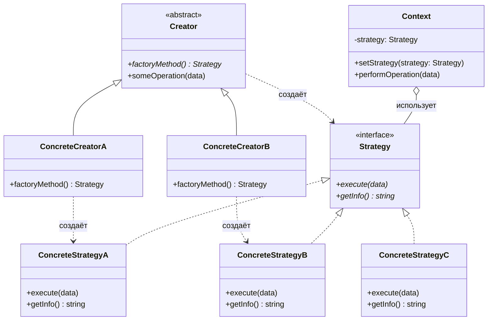
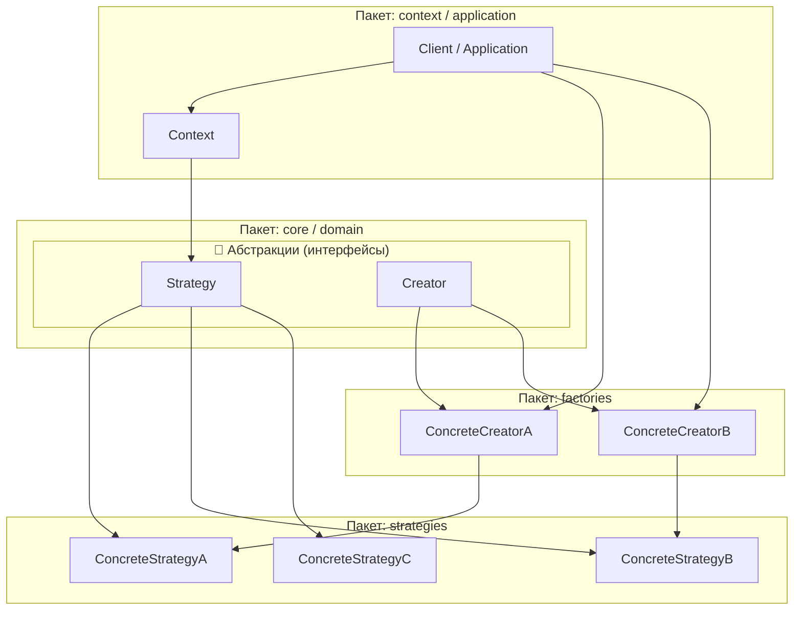
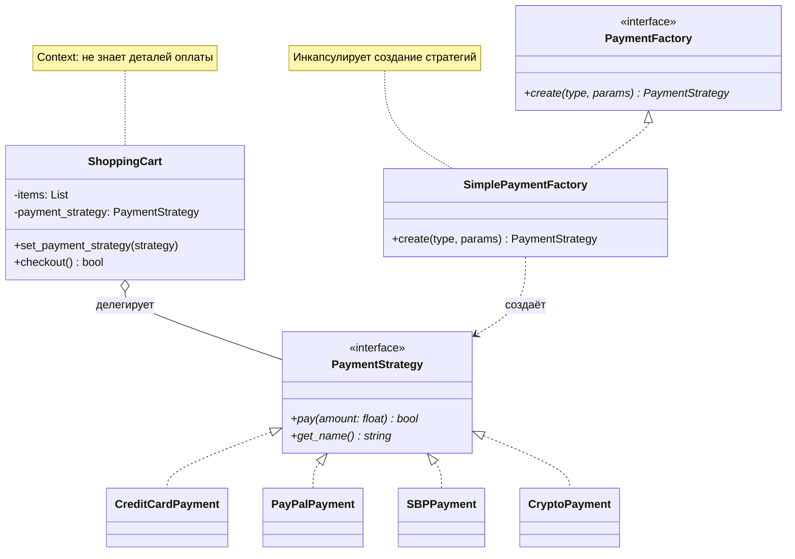
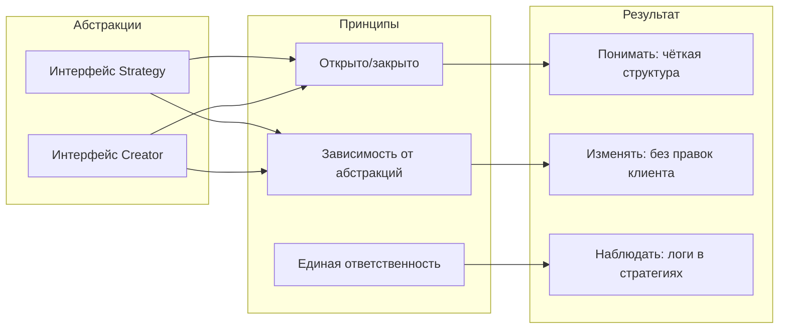
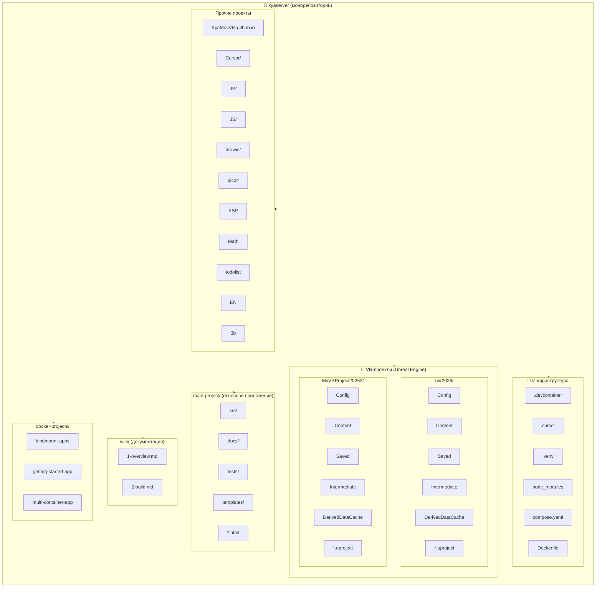
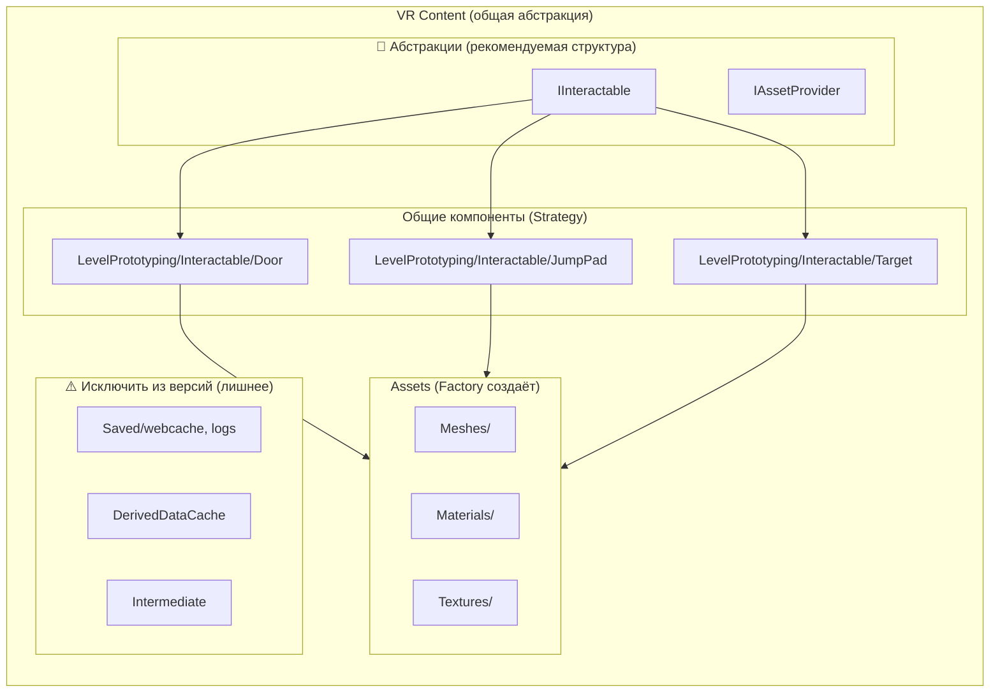
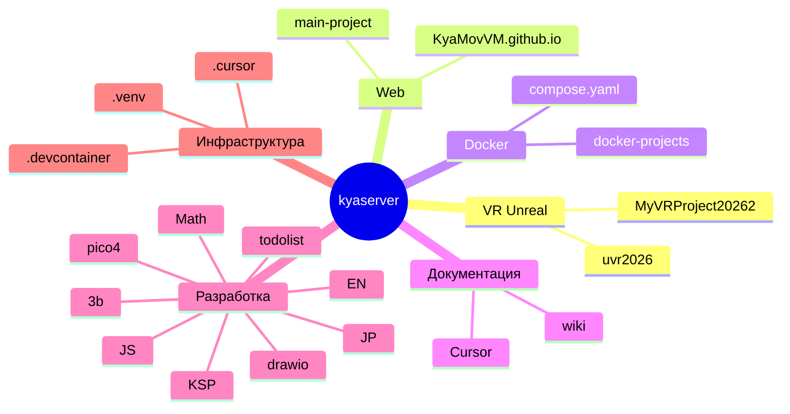

# Архитектурные диаграммы: Strategy + Factory Method

Цель: абстракция для удобного понимания, изменения и наблюдения за кодом.

---

## 1. Диаграмма классов (UML) — Strategy + Factory Method



---

## 2. Структура проекта (пакеты и модули)



---

## 3. Взаимодействие компонентов (Sequence-подобная схема)

```mermaid
sequenceDiagram
    participant Client as Client
    participant Factory as Creator / Factory
    participant Strategy as Strategy
    participant Context as Context
    
    Client->>Factory: createStrategy(type)
    Factory->>Strategy: new ConcreteStrategy()
    Factory-->>Client: strategy
    
    Client->>Context: setStrategy(strategy)
    Context->>Context: сохраняет strategy
    
    Client->>Context: performOperation(data)
    Context->>Strategy: execute(data)
    Strategy-->>Context: result
    Context-->>Client: result
```



---

## 4. Пример реального сценария: Платёжная система



---

## 5. Принципы для понимания и изменения



---

## 6. Полная UML-схема (комплексный вид)

```mermaid
classDiagram
    direction TB
    
    %% === ИНТЕРФЕЙСЫ ===
    class "<<interface>>\nIStrategy" as IStrategy {
        +execute(data)*
    }
    
    class "<<interface>>\nIFactory" as IFactory {
        +create(type)* IStrategy
    }
    
    %% === КОНТЕКСТ ===
    class "Context" as Context {
        -strategy: IStrategy
        +setStrategy(s)
        +doWork(data)
    }
    
    %% === РЕАЛИЗАЦИИ СТРАТЕГИЙ ===
    class "StrategyA" as SA
    class "StrategyB" as SB
    class "StrategyC" as SC
    
    %% === РЕАЛИЗАЦИИ ФАБРИК ===
    class "FactoryA" as FA {
        +create() StrategyA
    }
    
    class "FactoryB" as FB {
        +create() StrategyB
    }
    
    %% === СВЯЗИ ===
    IStrategy <|.. SA
    IStrategy <|.. SB
    IStrategy <|.. SC
    
    IFactory <|.. FA
    IFactory <|.. FB
    
    Context o--> IStrategy : 1..1
    
    FA ..> SA : создаёт
    FB ..> SB : создаёт
```

---

## Структура файлов проекта (рекомендуемая)

```
src/
├── abstractions/           # Интерфейсы (контракты)
│   ├── strategy.py         # IStrategy
│   └── factory.py          # ICreator / IFactory
│
├── strategies/             # Конкретные стратегии
│   ├── strategy_a.py
│   ├── strategy_b.py
│   └── strategy_c.py
│
├── factories/              # Фабрики создания
│   ├── factory_a.py
│   └── factory_b.py
│
├── context/                # Контекст (использует стратегию)
│   └── context.py
│
└── main.py                 # Точка входа, связывает всё
```

| Слой | Назначение | Изменять |
|------|------------|----------|
| `abstractions/` | Контракты, редко меняются | Почти никогда |
| `strategies/` | Новые алгоритмы, добавлять классы | Добавлять новые файлы |
| `factories/` | Выбор стратегии по условию | При добавлении стратегий |
| `context/` | Бизнес-логика | По необходимости |
| `main.py` | Композиция, запуск | При изменении сценариев |

---

## 7. Архитектура каталогов kyaserver (полная карта проектов)

Цель: абстракция для понимания, изменения и наблюдения. UML-стиль.



---

## 8. VR: Strategy + Factory — упрощение архитектуры (ключевое)

VR-проекты содержат много лишнего. Абстракция через Strategy и Factory Method.

```mermaid
classDiagram
    direction TB
    
    %% === АБСТРАКЦИИ (интерфейсы) ===
    class "<<interface>>\nIVRInteractionStrategy" as IVR {
        +interact(context)*
        +getInteractionType()* string
    }
    
    class "<<interface>>\nIVRProjectFactory" as IFactory {
        +createProject(config)* IVRProject
        +createInteraction(type)* IVRInteractionStrategy
    }
    
    class "<<interface>>\nIVRProject" as IProj {
        +loadContent()*
        +getConfig()* Config
    }
    
    %% === VR-проекты как продукты фабрики ===
    class "UVR2026Project" as UVR {
        +loadContent()
        +getConfig()
    }
    
    class "MyVRProject20262" as MyVR {
        +loadContent()
        +getConfig()
    }
    
    %% === Стратегии взаимодействия (общие для VR) ===
    class "DoorInteractionStrategy" as Door
    class "JumpPadInteractionStrategy" as JumpPad
    class "TargetInteractionStrategy" as Target
    
    IVR <|.. Door
    IVR <|.. JumpPad
    IVR <|.. Target
    
    IProj <|.. UVR
    IProj <|.. MyVR
    
    class "VRProjectFactory" as VRF {
        +createProject(name)* IVRProject
        +createInteraction(type)* IVRInteractionStrategy
    }
    
    IFactory <|.. VRF
    VRF ..> UVR : создаёт
    VRF ..> MyVR : создаёт
    VRF ..> Door : создаёт
    VRF ..> JumpPad : создаёт
    VRF ..> Target : создаёт
    
    note for VRF "Упрощает выбор проекта/стратегии"
    note for IVR "Content/LevelPrototyping/Interactable — общая структура"
```

---

## 9. Структура VR Content — что можно абстрагировать



---

## 10. Полная UML: проекты kyaserver + паттерны

```mermaid
classDiagram
    direction TB
    
    %% === КОРНЕВЫЕ ТИПЫ ПРОЕКТОВ ===
    class "<<abstract>>\nProjectRoot" as Root {
        +name: string
        +getRootPath()* string
        +listFormats()* string[]
    }
    
    class "UnrealVRProject" as URP {
        Config/
        Content/
        Saved/
        Intermediate/
        DerivedDataCache/
    }
    
    class "WebProject" as WP {
        *.html
        src/
        templates/
    }
    
    class "DockerProject" as DP {
        Dockerfile
        compose
    }
    
    class "DocumentationProject" as DocP {
        *.md
    }
    
    Root <|-- URP
    Root <|-- WP
    Root <|-- DP
    Root <|-- DocP
    
    %% === ФАБРИКА ПРОЕКТОВ ===
    class "ProjectFactory" as PF {
        +create(type: ProjectType)* ProjectRoot
        +detectFormat(path)* ProjectType
    }
    
    PF ..> URP : создаёт
    PF ..> WP : создаёт
    PF ..> DP : создаёт
    PF ..> DocP : создаёт
    
    %% === СТРАТЕГИЯ ЗАГРУЗКИ ===
    class "<<interface>>\nILoadStrategy" as ILS {
        +load(project)*
        +validate()* bool
    }
    
    class "UnrealLoadStrategy"
    class "WebLoadStrategy"
    class "DockerLoadStrategy"
    
    ILS <|.. UnrealLoadStrategy
    ILS <|.. WebLoadStrategy
    ILS <|.. DockerLoadStrategy
    
    URP o-- UnrealLoadStrategy : использует
    WP o-- WebLoadStrategy : использует
    DP o-- DockerLoadStrategy : использует
```

---

## 11. Карта корней проектов (все форматы)



---

## 12. Итоговая рекомендация: .gitignore для VR

| Каталог / Файл | Рекомендация | Причина |
|----------------|--------------|---------|
| `Saved/` | Игнорировать | webcache, логи, EditorPerProjectUserSettings |
| `DerivedDataCache/` | Игнорировать | Кэш сборки |
| `Intermediate/` | Игнорировать | Временные артефакты |
| `Content/` | Версионировать | Blueprints, Meshes, Materials — ключевое |
| `Config/` | Версионировать | DefaultEngine, DefaultGame |
| `*.uproject` | Версионировать | Описание проекта |
